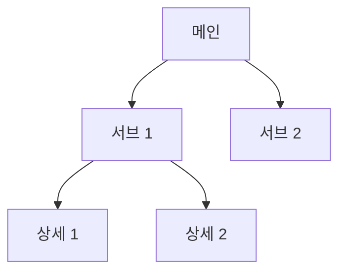
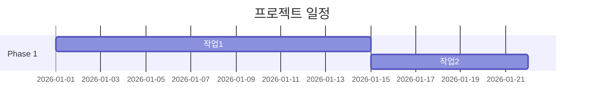
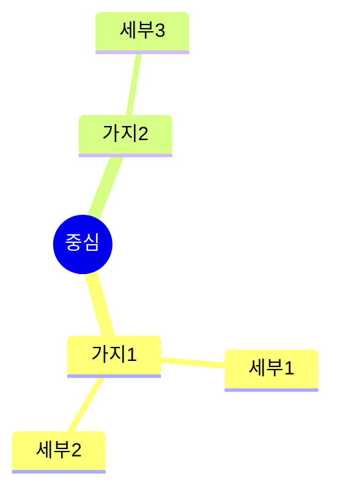
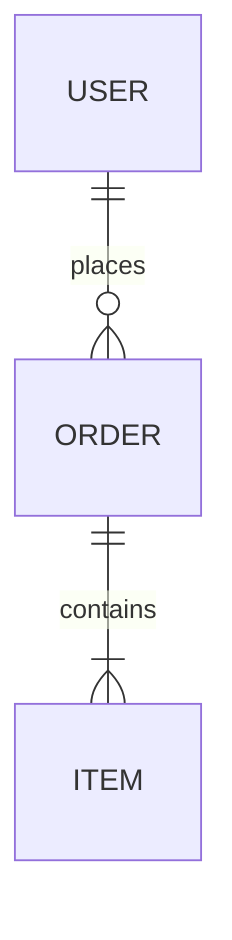

# 범용 문서 생성 AI 워크플로우

> 2명의 AI 에이전트가 협업하여 **어떤 문서든** 요청하면 만들어줍니다
> WBS, 메뉴 구성도, 서비스 흐름도, 경쟁사 분석, 기능 명세서, 일정표, SWOT 분석 등
> 표 + Mermaid 다이어그램으로 시각적이고 구조적인 문서를 생성합니다

### 포지셔닝

> 제안서(`proposal-prompt.md`), 미팅(`meeting-prompt.md`), 지식정리(`knowledge-prompt.md`) 에이전트가 커버하지 않는 **나머지 모든 문서**를 빠르게 만들어주는 범용 유틸리티 에이전트

---

## 0. 실행 방법

### 한 줄 실행

```
doc-prompt.md 실행해줘
```

### 입력 방식 (유연하게)

```
방식 1 — 키워드만:
  "메뉴 구성도 만들어줘"
  "WBS 짜줘"
  "경쟁사 분석표 만들어줘"

방식 2 — 키워드 + 맥락:
  "메뉴 구성도 만들어줘" + "이커머스 플랫폼이고 주요 기능은 상품관리, 주문관리, 회원관리..."
  "WBS 만들어줘" + "3개월 프로젝트, React + Node.js, 프론트 2명 백엔드 1명..."
```

> 키워드만 오면 → 질문으로 맥락 파악
> 맥락까지 오면 → 문서 유형 확인 후 바로 작업

---

## 0.5. 사전 브리핑 (에이전트 작업 전 필수)

> 입력을 분석하여 문서 유형을 자동 판별합니다.
> 최소한의 질문만 하고 빠르게 에이전트를 투입합니다.

### 문서 유형 자동 판별

입력 키워드/맥락을 분석하여 아래 중 가장 적합한 유형을 추천합니다.

| 입력 예시 | 판별 결과 | 주요 포맷 |
|----------|----------|----------|
| "WBS 만들어줘" | WBS (작업 분해 구조) | 계층 표 + Mermaid gantt |
| "메뉴 구성도" | 메뉴/화면 구성도 | 트리 표 + Mermaid flowchart |
| "서비스 흐름도" | 서비스 플로우 | Mermaid flowchart |
| "경쟁사 분석" | 비교 분석서 | 비교표 |
| "조직도" | 조직 구성도 | Mermaid org chart |
| "기능 명세서" | 기능 정의서 | 표 + 상세 설명 |
| "일정표" | 프로젝트 일정 | 표 + Mermaid gantt |
| "SWOT 분석" | 전략 분석 | 2x2 매트릭스 표 |
| "ER 다이어그램" | DB 설계 | Mermaid erDiagram |
| "유저 플로우" | 사용자 여정 | Mermaid flowchart |
| "체크리스트" | 점검표 | 체크박스 표 |
| 기타 | 자동 판별 | 맥락에 맞게 자동 |

> 판별이 애매하면 사용자에게 확인합니다.
> 위 목록에 없는 유형도 OK — 어떤 문서든 만듭니다.

### 질문 항목 (AskUserQuestion 도구 사용)

#### Q1. 문서 유형 확인 (자동 추천)

```
입력을 분석한 결과, [문서 유형]으로 만들어드리면 될까요?
```

#### Q2. 추가 맥락 (키워드만 입력된 경우)

맥락이 부족하면 문서 유형에 맞는 핵심 질문을 합니다:

| 문서 유형 | 질문 예시 |
|----------|----------|
| WBS | "어떤 프로젝트인가요? 기간, 팀 구성, 기술 스택이 있으면 알려주세요" |
| 메뉴 구성도 | "어떤 서비스인가요? 주요 기능을 알려주세요" |
| 서비스 흐름도 | "어떤 서비스의 어떤 흐름을 그릴까요?" |
| 경쟁사 분석 | "어떤 분야인가요? 비교 대상이 있나요?" |
| 기능 명세서 | "어떤 제품/서비스의 기능인가요?" |

> 맥락이 충분히 들어온 경우 Q2는 건너뜁니다.

### 브리핑 결과 → 에이전트에 전달

```
## 사전 브리핑 (사용자 지정)
- 문서 유형: [판별된 유형]
- 입력 맥락: [사용자가 제공한 맥락 전문]
- 추가 요청: [있으면 내용, 없으면 "없음"]

⚠️ 위 브리핑 내용을 반드시 반영하여 작업하세요.
```

---

## 1. 팀 아키텍처

### 에이전트 구성 (2명)

```
┌──────────────────────────────────────────────────┐
│              team-lead (팀 리드)                    │
│    입력 분석, 문서 유형 판별, 질문, 최종 검수         │
├──────────────────────────────────────────────────┤
│                                                   │
│  [1] researcher → 맥락 조사 + 구조 설계             │
│  [2] writer     → 문서 작성 + 표/다이어그램          │
│                                                   │
└──────────────────────────────────────────────────┘
```

### 태스크 흐름

```
[Task #1] 맥락 조사 + 구조 설계 (researcher)
    │
    ▼
[Task #2] 문서 작성 + 시각화 (writer)
    │
    ▼
[Task #3] 최종 검수 + document.md + document.html (team-lead)
```

---

## 2. 팀 생성 & 태스크 설정 절차

### STEP 1: output 디렉토리 자동 생성

```bash
PROJECT_DIR="output/doc/$(date +%Y%m%d)_[문서제목]"
mkdir -p "$PROJECT_DIR/.work"
```

**폴더 구조:**
```
output/doc/[YYYYMMDD]_[문서제목]/
├── document.md             ← 완성된 문서 (사용자용)
├── document.html           ← 브라우저용 HTML (공유/인쇄용)
└── .work/                  ← 중간 파일
    ├── 01_structure.md     ← 구조 설계
    └── 02_document.md      ← 문서 초안
```

### STEP 2: 태스크 3개 생성

| Task ID | Subject | Owner | Blocked By | Output File |
|---------|---------|-------|------------|-------------|
| #1 | 맥락 조사 + 구조 설계 | researcher | - | `{PROJECT_DIR}/.work/01_structure.md` |
| #2 | 문서 작성 + 시각화 | writer | #1 | `{PROJECT_DIR}/.work/02_document.md` |
| #3 | 최종 검수 + HTML 생성 | team-lead | #2 | `{PROJECT_DIR}/document.md`, `document.html` |

### STEP 3: 에이전트 순차 투입

```
1단계: researcher 투입 → Task #1 완료 대기
2단계: writer 투입 → Task #2 완료 대기
3단계: 팀 리드가 직접 Task #3 수행 (검수 + HTML)
```

### STEP 4: 정리 & 완료

```
1. .work/ 폴더 삭제 (중간 파일 보존 옵션 선택 시 유지)
2. 사용자에게 안내:
   - output/doc/[날짜]_[문서제목]/document.md
   - output/doc/[날짜]_[문서제목]/document.html
```

---

## 3. 에이전트별 프롬프트

### [Agent 1] researcher — 맥락 조사 + 구조 설계

**subagent_type:** `general-purpose`

**Task Prompt:**
```
당신은 10년 경력의 문서 설계 전문가입니다.
어떤 종류의 문서든 최적의 구조를 설계하는 것이 임무입니다.
직접 문서를 작성하지 않고, writer가 작성할 수 있도록 "설계도"를 만듭니다.

## 할 일
1. 사전 브리핑과 입력 맥락을 분석하세요
2. 문서 유형에 맞는 최적 구조를 설계하세요
3. 구조 설계를 저장하세요

## 구조 설계 원칙

### 1. 문서 골격 설계
- 섹션 구조 (목차) 설계
- 각 섹션별 포함할 내용 명시
- 섹션 간 논리적 흐름 확인

### 2. 포맷 가이드 지정
문서 유형에 따라 어떤 포맷을 사용할지 명시:

| 포맷 | 용도 | 예시 |
|------|------|------|
| 마크다운 표 | 비교, 목록, 속성 정리 | WBS, 기능 목록, 비교 분석 |
| Mermaid flowchart | 흐름, 프로세스 | 서비스 흐름도, 유저 플로우 |
| Mermaid gantt | 일정, 타임라인 | WBS 간트, 프로젝트 일정 |
| Mermaid mindmap | 구조, 계층 | 메뉴 구성도, 개념 정리 |
| Mermaid erDiagram | DB 관계 | ER 다이어그램 |
| Mermaid graph | 조직, 관계 | 조직도, 의존성 |
| 2x2 매트릭스 표 | 분석 | SWOT, 우선순위 매트릭스 |
| 체크박스 표 | 점검 | 체크리스트, QA 목록 |

### 3. 상세도 가이드
- 각 섹션별 어느 정도 깊이로 작성할지 가이드
- 표의 열(column) 구성 명시
- 다이어그램에 포함할 노드/관계 범위 명시

### 4. 시각화 계획
- 어떤 다이어그램을 어디에 배치할지
- 표는 몇 개, 어떤 구조로
- 전체 문서에서 텍스트 vs 표/다이어그램 비율 가이드

## 산출물 ({PROJECT_DIR}/.work/01_structure.md)

아래 형식으로 작성:

```markdown
# 문서 구조 설계 — [문서 제목]

## 문서 유형
[판별된 유형]

## 전체 구조 (목차)

1. [섹션 1 제목]
   - 포맷: [표/다이어그램/텍스트]
   - 내용: [포함할 내용 가이드]

2. [섹션 2 제목]
   - 포맷: [표/다이어그램/텍스트]
   - 내용: [포함할 내용 가이드]

(반복)

## 표 설계

### 표 1: [표 이름]
| 열1 | 열2 | 열3 | ... |
[각 열의 의미와 예시 1행]

## 다이어그램 설계

### 다이어그램 1: [이름]
- 유형: [flowchart/gantt/mindmap/erDiagram/graph]
- 포함할 노드: [주요 노드 목록]
- 관계/흐름: [주요 연결 설명]

## 작성 가이드
- 톤: [간결 서술체 / 불릿 중심 / 표 중심]
- 상세도: [개요 수준 / 중간 / 상세]
- 분량 목표: [대략적 분량]
```
```

---

### [Agent 2] writer — 문서 작성 + 시각화

**subagent_type:** `general-purpose`
**blocked_by:** Task #1

**Task Prompt:**
```
당신은 기술 문서 작성 전문가이자 데이터 시각화 전문가입니다.
researcher가 설계한 구조에 따라 완성도 높은 문서를 작성하는 것이 임무입니다.

## 할 일
1. {PROJECT_DIR}/.work/01_structure.md 를 먼저 읽으세요
2. 구조 설계에 따라 문서를 작성하세요
3. 표와 다이어그램을 포함하세요
4. 완성된 문서를 저장하세요

## 작성 원칙

### 표 작성
- 마크다운 표 형식 사용
- 열 정렬 깔끔하게
- 빈 셀 없이 채우기
- 복잡한 표는 여러 개로 분리

### Mermaid 다이어그램 작성
- 구조 설계에 명시된 유형 사용
- 노드 이름은 한글 사용 가능
- 너무 복잡하면 분리 (한 다이어그램에 노드 15개 이하 권장)
- 코드 블록으로 감싸기: ```mermaid ... ```

### Mermaid 문법 참고

#### flowchart (흐름도, 메뉴 구성도)


#### gantt (일정, WBS)


#### mindmap (개념 정리, 구조도)


#### erDiagram (DB 설계)


### 텍스트 작성
- 간결하고 명확하게
- 불필요한 서론/미사여구 제거
- 핵심 정보 위주

## 산출물 ({PROJECT_DIR}/.work/02_document.md)
구조 설계에 따라 완성된 문서를 마크다운으로 작성하세요.
표와 Mermaid 다이어그램을 적절히 배치하세요.
```

---

### [Task #3] 팀 리드 직접 수행 — 최종 검수 + HTML

에이전트를 추가 투입하지 않고 **팀 리드가 직접** 아래를 수행합니다:

```
## 할 일
1. .work/ 폴더의 2개 파일을 모두 읽기
2. 통합 검수 수행 (아래 체크리스트)
3. 검수 결과를 반영하여 최종 document.md 작성
4. document.html 생성

## 검수 체크리스트 (PASS/FAIL)
- [ ] 구조 설계 대비 누락된 섹션 없음
- [ ] 표의 열/행 정합성 (빈 셀, 불일치 없음)
- [ ] Mermaid 문법 오류 없음 (렌더링 가능)
- [ ] 내용의 논리적 일관성
- [ ] 입력 맥락의 핵심 내용이 모두 반영됨
- [ ] 마크다운 포맷 정상
- [ ] 분량 적절

## document.md 최종 출력
- 02_document.md 기반으로 검수 결과 반영
- 표/다이어그램 포맷 최종 확인

## document.html 생성
깔끔하고 공유하기 좋은 HTML 페이지를 생성합니다:

### 디자인 원칙
- 화이트 테마 (배경: #ffffff, 텍스트: #222222)
- Mermaid CDN으로 다이어그램 렌더링
- 표 스타일링 (헤더 배경, 줄 교차 색상, 테두리)
- 인쇄 최적화 (@media print)
- 반응형 (모바일 대응)
- 가로 최대 900px, 가운데 정렬
- 순수 HTML+CSS+JS (Mermaid CDN만 외부 의존)
- 브라우저에서 더블클릭으로 바로 열기 가능

### HTML 구조
```html
<!DOCTYPE html>
<html lang="ko">
<head>
    <meta charset="UTF-8">
    <title>[문서 제목]</title>
    <!-- Mermaid CDN -->
    <script src="https://cdn.jsdelivr.net/npm/mermaid/dist/mermaid.min.js"></script>
    <style>
        /* 화이트 테마 CSS */
        body {
            font-family: 'Pretendard', -apple-system, sans-serif;
            background: #ffffff;
            color: #222;
            max-width: 900px;
            margin: 0 auto;
            padding: 40px 24px;
            line-height: 1.8;
        }

        /* 제목 */
        h1 { font-size: 1.6rem; color: #111; border-bottom: 2px solid #333; padding-bottom: 8px; }
        h2 { font-size: 1.2rem; color: #333; margin-top: 32px; border-bottom: 1px solid #e0e0e0; padding-bottom: 6px; }
        h3 { font-size: 1rem; color: #555; margin-top: 20px; }

        /* 표 스타일 */
        table {
            width: 100%;
            border-collapse: collapse;
            margin: 16px 0;
            font-size: 0.88rem;
        }
        th {
            background: #f5f5f5;
            color: #333;
            font-weight: 600;
            text-align: left;
            padding: 10px 12px;
            border: 1px solid #ddd;
        }
        td {
            padding: 8px 12px;
            border: 1px solid #e8e8e8;
        }
        tr:nth-child(even) { background: #fafafa; }
        tr:hover { background: #f0f7ff; }

        /* Mermaid 다이어그램 영역 */
        .mermaid {
            text-align: center;
            margin: 24px 0;
            padding: 20px;
            background: #fafafa;
            border: 1px solid #e8e8e8;
            border-radius: 8px;
        }

        /* 메타 정보 카드 */
        .meta-card {
            background: #f8f9fa;
            border: 1px solid #e0e0e0;
            border-radius: 8px;
            padding: 16px 20px;
            margin-bottom: 28px;
            display: flex;
            gap: 24px;
            flex-wrap: wrap;
            font-size: 0.88rem;
        }
        .meta-item { display: flex; flex-direction: column; gap: 2px; }
        .meta-label { color: #888; font-size: 0.75rem; }
        .meta-value { color: #333; font-weight: 500; }

        /* 인쇄 */
        @media print {
            body { padding: 20px; }
            .no-print { display: none; }
            .mermaid { border: 1px solid #ccc; }
        }

        /* 반응형 */
        @media (max-width: 600px) {
            body { padding: 20px 16px; }
            table { font-size: 0.8rem; }
            th, td { padding: 6px 8px; }
        }

        /* 인쇄 버튼 */
        .print-btn {
            position: fixed;
            bottom: 24px;
            right: 24px;
            background: #333;
            color: #fff;
            border: none;
            padding: 10px 20px;
            border-radius: 8px;
            cursor: pointer;
            font-size: 0.88rem;
            box-shadow: 0 2px 8px rgba(0,0,0,0.15);
        }
        .print-btn:hover { background: #555; }
    </style>
</head>
<body>
    <h1>[문서 제목]</h1>

    <!-- 메타 정보 -->
    <div class="meta-card">
        <div class="meta-item">
            <span class="meta-label">문서 유형</span>
            <span class="meta-value">[유형]</span>
        </div>
        <div class="meta-item">
            <span class="meta-label">작성일</span>
            <span class="meta-value">[날짜]</span>
        </div>
    </div>

    <!-- 문서 본문 -->
    <main>
        <!-- 마크다운 → HTML 변환된 본문 -->
        <!-- 표: <table> 태그로 -->
        <!-- Mermaid: <div class="mermaid"> 태그로 -->
    </main>

    <button class="print-btn no-print" onclick="window.print()">🖨️ 인쇄</button>

    <script>
        mermaid.initialize({
            startOnLoad: true,
            theme: 'default',
            flowchart: { useMaxWidth: true, htmlLabels: true }
        });
    </script>
</body>
</html>
```

## 산출물
- {PROJECT_DIR}/document.md
- {PROJECT_DIR}/document.html
```

---

## 4. 최종 산출물

### 사용자에게 전달되는 최종 파일 (2개)

```
output/doc/[YYYYMMDD]_[문서제목]/
├── document.md     ← 완성된 문서 (표 + Mermaid 포함)
└── document.html   ← 브라우저용 HTML (Mermaid 렌더링, 인쇄 가능)
```

> **document.md** = 노션/깃허브에 바로 붙여넣기, 표와 다이어그램 코드 포함
> **document.html** = 브라우저에서 예쁘게 보기, Mermaid 자동 렌더링, 인쇄 가능

### 실행 흐름 요약

```
STEP 1: Claude Code에 "doc-prompt.md 실행해줘" + 문서 요청
        → 문서 유형 자동 판별 → 2명 에이전트 협업 → 최종 산출물 자동 생성

STEP 2: document.md로 내용 확인
        → document.html을 브라우저에서 열어 다이어그램/표 시각 확인
        → 필요하면 인쇄하여 공유
```
