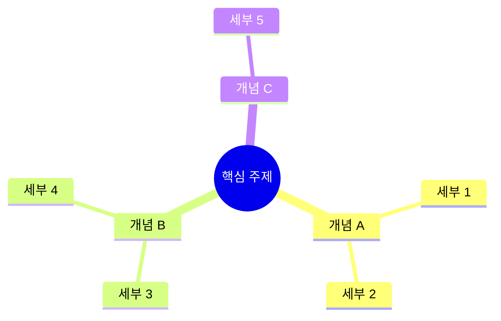

# 지식 정리 AI 드림팀 워크플로우

> 5명의 전문 AI 에이전트가 **병렬 협업**하여 소스(영상/PDF/링크/텍스트) → 분석 + 요약 + 정리를 자동 생성합니다
> **핵심 요약본** (1-2p 빠른 복습용) + **실무 적용 분석서** (도입 전략+비교 분석) + **상세 구조화 정리본** (실습코드+마인드맵+액션아이템) 3개를 동시에 출력합니다

---

## 0. 실행 방법

### 한 줄 실행

```
knowledge-prompt.md 실행해줘
```

### 필요 입력: 소스 1개 이상

```
- 유튜브 URL: https://youtube.com/watch?v=... (자막 기반 분석)
- 웹 링크: https://blog.example.com/... (본문 추출)
- PDF 파일 경로: /path/to/file.pdf (직접 읽기)
- 텍스트 직접 입력: "내용을 여기에 붙여넣기"
```

---

## 0.5. 사전 브리핑 (에이전트 작업 전 필수)

> 소스를 수집한 직후, 에이전트를 투입하기 전에 아래 질문을 사용자에게 합니다.
> 소스 내용을 분석하여 **추천안을 먼저 제시**하고, 사용자가 선택하거나 직접 입력합니다.

### 질문 항목 (AskUserQuestion 도구 사용)

#### Q1. 정리 깊이
| 추천 | 깊이 | 설명 | 적합한 상황 |
|------|------|------|------------|
| A | 빠른 요약 | 요약본만 생성 (상세 정리 생략) | 가볍게 훑어보기, 스크리닝 |
| B (추천) | 표준 | 요약본 + 상세 정리본 동시 생성 | 일반적인 학습/정리 |
| C | 딥다이브 | 요약 + 상세 + 관련 리소스 추가 조사 | 깊이 파고들 주제 |

#### Q2. 카테고리 (자동 추천)
소스 내용을 분석하여 자동으로 카테고리를 추천합니다.

**카테고리 예시:**
| 대분류 | 소분류 예시 |
|--------|-----------|
| Frontend | React, Next.js, CSS, TypeScript |
| Backend | Node.js, Python, Go, DB |
| DevOps | Docker, K8s, CI/CD, Cloud |
| AI/ML | LLM, Prompt Engineering, ML Ops |
| Architecture | System Design, DDD, MSA |
| Career | 커리어, 생산성, 개발문화 |

> 팀 리드가 소스를 분석한 뒤 가장 적합한 카테고리를 (추천)으로 표시합니다.
> 사용자는 직접 입력도 가능합니다.

#### Q3. 태그 (자동 추천)
소스에서 핵심 키워드를 추출하여 3-5개 태그를 자동 추천합니다.

#### Q4. 추가 컨텍스트 (선택)
```
이 소스에 대해 특별히 집중해서 정리해줬으면 하는 부분이 있으면 알려주세요.
없으면 건너뛰어도 됩니다.
```

### 브리핑 결과 → 에이전트에 전달

사용자 답변을 정리하여 **모든 에이전트 프롬프트에 아래 블록을 추가**합니다:

```
## 사전 브리핑 (사용자 지정)
- 정리 깊이: [선택한 깊이]
- 카테고리: [선택한 카테고리]
- 태그: [확정된 태그들]
- 추가 컨텍스트: [있으면 내용, 없으면 "없음"]

⚠️ 위 브리핑 내용을 반드시 반영하여 작업하세요.
```

---

## 1. 팀 아키텍처

### 에이전트 구성 (5명)

```
┌─────────────────────────────────────────────────────┐
│                team-lead (팀 리드)                    │
│     소스 입력 처리, 태스크 관리, 최종 통합, 노트 연결   │
├─────────────────────────────────────────────────────┤
│                                                      │
│  [1] collector   → 소스 수집 + 텍스트 추출             │
│  [2] analyzer    → 핵심 분석 + 구조화                  │
│  [3] summarizer  → 핵심 요약본 작성          ← 병렬    │
│  [4] strategist  → 실무 적용 분석서 작성     ← 병렬    │
│  [5] writer      → 상세 정리본 + 마인드맵    ← 병렬    │
│                                                      │
└─────────────────────────────────────────────────────┘
```

### 태스크 의존성 & 병렬 처리 구조

```
[Task #1] 소스 수집 + 텍스트 추출 (collector)
    │
    ▼
[Task #2] 핵심 분석 + 구조화 (analyzer)
    │
    ├──────────────────┬──────────────────┐
    ▼                  ▼                  ▼
[Task #3]          [Task #4]          [Task #5]         ← #2 완료 후 3개 동시 병렬
핵심 요약본        실무 적용 분석서     상세 정리본
(summarizer)       (strategist)       (writer)
    │                  │                  │
    └──────────┬───────┴──────────────────┘
               ▼
[Task #6] 최종 통합 + 검수 + HTML + 기존 노트 연결 (team-lead)  ← #3,#4,#5 모두 완료 후
```

---

## 2. 팀 생성 & 태스크 설정 절차

### STEP 1: 소스별 output 디렉토리 자동 생성

```bash
PROJECT_DIR="output/knowledge/$(date +%Y%m%d)_[주제명]"
mkdir -p "$PROJECT_DIR/.work"
```

**폴더 구조:**
```
output/knowledge/[YYYYMMDD]_[주제명]/
├── summary.md              ← 핵심 요약본 (사용자용)
├── analysis.md             ← 실무 적용 분석서 (사용자용)
├── detail.md               ← 상세 구조화 정리본 (사용자용)
├── detail.html             ← 브라우저용 예쁜 HTML (사용자용)
└── .work/                  ← 중간 파일 (완료 후 삭제 가능)
    ├── 01_raw_content.md   ← 추출된 원본 텍스트
    ├── 02_analysis.md      ← 분석 결과
    ├── 03_summary.md       ← 요약본 초안
    ├── 04_strategy.md      ← 실무 적용 분석 초안
    └── 05_detail.md        ← 상세본 초안
```

### STEP 2: 태스크 6개 생성 + 의존성 설정

| Task ID | Subject | Owner | Blocked By | Output File |
|---------|---------|-------|------------|-------------|
| #1 | 소스 수집 + 텍스트 추출 | collector | - | `{PROJECT_DIR}/.work/01_raw_content.md` |
| #2 | 핵심 분석 + 구조화 | analyzer | #1 | `{PROJECT_DIR}/.work/02_analysis.md` |
| #3 | 핵심 요약본 작성 | summarizer | #2 | `{PROJECT_DIR}/.work/03_summary.md` |
| #4 | 실무 적용 분석서 작성 | strategist | #2 | `{PROJECT_DIR}/.work/04_strategy.md` |
| #5 | 상세 정리본 + 마인드맵 작성 | writer | #2 | `{PROJECT_DIR}/.work/05_detail.md` |
| #6 | 최종 통합 + 검수 + HTML + 노트 연결 | team-lead | #3, #4, #5 | `{PROJECT_DIR}/summary.md`, `analysis.md`, `detail.md`, `detail.html` |

### STEP 3: 에이전트 순차/병렬 투입

```
1단계: collector 투입 → Task #1 완료 대기
2단계: analyzer 투입 → Task #2 완료 대기
3단계: summarizer + strategist + writer 동시 투입 (3개 병렬) → Task #3, #4, #5 모두 완료 대기
4단계: 팀 리드가 직접 Task #6 수행 (통합 + 검수 + HTML + 기존 노트 연결)
```

### STEP 4: 정리 & 완료

```
1. .work/ 폴더 삭제 (중간 파일 보존 옵션 선택 시 유지)
2. 사용자에게 안내:
   - output/knowledge/[날짜]_[주제명]/summary.md (핵심 요약본)
   - output/knowledge/[날짜]_[주제명]/analysis.md (실무 적용 분석서)
   - output/knowledge/[날짜]_[주제명]/detail.md (상세 정리본 + 마인드맵)
   - output/knowledge/[날짜]_[주제명]/detail.html (브라우저에서 미리보기)
3. 관련 노트가 있으면 연결 정보 안내
4. (노션 MCP 연동 시) 노션 데이터베이스에 자동 업로드
```

---

## 3. 에이전트별 프롬프트

### [Agent 1] collector — 소스 수집 + 텍스트 추출

**subagent_type:** `general-purpose`

**Task Prompt:**
```
당신은 콘텐츠 수집 전문가입니다.
다양한 소스에서 텍스트를 깔끔하게 추출하는 것이 임무입니다.

## 할 일
1. 소스 타입을 판별하세요
2. 타입에 맞는 방법으로 텍스트를 추출하세요
3. 추출된 텍스트를 정제하여 저장하세요

## 소스별 추출 방법

### 유튜브 영상
1. WebFetch로 유튜브 페이지 접근
2. 자막(CC) 텍스트 추출
3. 타임스탬프 보존 (주요 구간별)
4. 영상 메타 정보 수집: 제목, 채널명, 업로드일, 조회수, 영상 길이

### 웹 링크 (블로그/아티클/문서)
1. WebFetch로 페이지 본문 추출
2. 불필요한 네비게이션/광고/푸터 제거
3. 메타 정보 수집: 제목, 저자, 게시일, 사이트명

### PDF 파일
1. Read 도구로 PDF 직접 읽기
2. 페이지별 텍스트 추출
3. 메타 정보 수집: 제목, 저자, 페이지 수

### 직접 텍스트 입력
1. 사용자가 붙여넣은 텍스트 그대로 사용
2. 출처 정보가 있으면 기록

## 산출물 ({PROJECT_DIR}/.work/01_raw_content.md)

아래 형식으로 작성:

```markdown
# 원본 콘텐츠

## 메타 정보
- 소스 타입: [유튜브/웹/PDF/텍스트]
- 원본 URL: [URL 또는 "직접 입력"]
- 제목: [제목]
- 저자/채널: [이름]
- 날짜: [게시일/업로드일]
- 추가 정보: [조회수, 페이지 수 등]

## 추출된 본문

[정제된 텍스트 전문]

## 타임스탬프 (영상인 경우)

| 시간 | 주제 |
|------|------|
| 00:00 | [주제] |
| 05:30 | [주제] |
| ... | ... |
```
```

---

### [Agent 2] analyzer — 핵심 분석 + 구조화

**subagent_type:** `general-purpose`
**blocked_by:** Task #1

**Task Prompt:**
```
당신은 10년 경력의 시니어 개발자이자 기술 콘텐츠 분석 전문가입니다.
원본 텍스트에서 핵심을 추출하고 체계적으로 구조화하는 것이 임무입니다.

## 할 일
1. {PROJECT_DIR}/.work/01_raw_content.md 를 먼저 읽으세요
2. 원본 콘텐츠를 깊이 분석하세요
3. 분석 결과를 구조화하여 저장하세요

## 분석 항목

### 1. 콘텐츠 개요
- 한줄 요약 (1문장)
- 핵심 주제 (1-2개)
- 난이도 판정 (초급/중급/고급)
- 대상 독자

### 2. 핵심 개념 추출
- 핵심 포인트 3-5개 (중요도 순)
- 각 포인트별: 개념 설명 + 왜 중요한지 + 실무 적용점

### 3. 구조 분석
- 원본의 논리 흐름 파악
- 최적 목차 구조 설계 (섹션 분류)
- 각 섹션별 핵심 내용 요약

### 4. 코드/실습 요소 추출
- 원본에 포함된 코드 스니펫 정리
- 핵심 개념을 보여주는 코드 예시 설계
- 실습 가능한 코드 블록 구성

### 5. 키 인사이트
- 저자의 핵심 주장/인사이트 2-3개
- "아하!" 모먼트 (가장 가치 있는 부분)
- 기존 지식과의 연결점

### 6. 액션 아이템
- 이 콘텐츠를 보고 실천할 수 있는 것들 3-5개
- 우선순위 태깅 (즉시/이번주/나중에)

### 7. 핵심 용어
- 중요 기술 용어 정리 (용어 + 한줄 설명)

### 8. 관련 리소스 (딥다이브 모드 시)
- 추가 학습을 위한 관련 자료 추천

## 산출물 ({PROJECT_DIR}/.work/02_analysis.md)
위 분석 항목을 마크다운으로 체계적으로 정리하세요.
```

---

### [Agent 3] summarizer — 핵심 요약본 작성 (병렬 A)

**subagent_type:** `general-purpose`
**blocked_by:** Task #2

**Task Prompt:**
```
당신은 기술 콘텐츠 요약 전문가입니다.
복잡한 기술 내용을 1-2페이지로 핵심만 압축하여 전달하는 것이 임무입니다.

## 할 일
1. {PROJECT_DIR}/.work/01_raw_content.md 를 읽으세요
2. {PROJECT_DIR}/.work/02_analysis.md 를 읽으세요
3. 핵심 요약본을 작성하세요

## 요약본 작성 원칙
- 1-2페이지 분량 (스크롤 최소화)
- 30초 안에 핵심을 파악할 수 있도록
- 불릿 포인트 중심 (장문 X)
- 코드는 핵심 1-2개만 (있는 경우)
- 복습용으로 최적화

## 산출물 ({PROJECT_DIR}/.work/03_summary.md)

아래 형식으로 작성:

```markdown
# [제목]

> **원본:** [소스 URL/출처]
> **분류:** [카테고리] | **태그:** [태그들]
> **난이도:** [초급/중급/고급] | **정리일:** [날짜]

---

## 💡 한줄 요약

[한 문장으로 이 콘텐츠의 핵심]

## 📌 핵심 포인트

1. **[포인트 1 제목]**
   [2-3줄 설명]

2. **[포인트 2 제목]**
   [2-3줄 설명]

3. **[포인트 3 제목]**
   [2-3줄 설명]

(3-5개)

## 🔑 키 인사이트

> [가장 중요한 인사이트 — 인용 또는 핵심 문장]

- [인사이트 1]
- [인사이트 2]

## ✅ 액션 아이템

- [ ] [즉시] 실천할 것 1
- [ ] [이번주] 실천할 것 2
- [ ] [나중에] 실천할 것 3

## 🔗 원본 바로가기

[원본 링크]
```
```

---

### [Agent 4] strategist — 실무 적용 분석서 작성 (병렬 B)

**subagent_type:** `general-purpose`
**blocked_by:** Task #2

**Task Prompt:**
```
당신은 15년 경력의 시니어 개발자이자 기술 전략 컨설턴트입니다.
기술 콘텐츠를 실무 관점에서 분석하여 "어떻게 적용할 것인가"를 설계하는 것이 임무입니다.

## 할 일
1. {PROJECT_DIR}/.work/01_raw_content.md 를 읽으세요
2. {PROJECT_DIR}/.work/02_analysis.md 를 읽으세요
3. 실무 적용 분석서를 작성하세요

## 분석 항목

### 1. 기술/개념 평가
- 이 기술/방법론의 핵심 가치는 무엇인가?
- 어떤 문제를 해결하는가?
- 기존 방식 대비 장점과 한계는?

### 2. 대안 기술 비교표
| 비교 항목 | 이 기술 | 대안 A | 대안 B |
|----------|---------|--------|--------|
| 학습 곡선 | | | |
| 성능 | | | |
| 생태계/커뮤니티 | | | |
| 적합한 규모 | | | |
| 유지보수성 | | | |

### 3. 도입 적합성 판단
- ✅ 도입하면 좋은 경우 (구체적 시나리오)
- ⚠️ 주의해야 할 경우
- ❌ 도입하지 않는 게 나은 경우

### 4. 실무 도입 로드맵
- **Phase 1 (즉시):** 바로 시도해볼 수 있는 것
- **Phase 2 (1-2주):** 파일럿 프로젝트에 적용
- **Phase 3 (1개월+):** 프로덕션 도입 시 고려사항

### 5. 도입 전후 비교 시나리오
**Before (현재):**
- [현재 방식의 pain point]
- [소요 시간/비용]

**After (도입 후):**
- [개선되는 점]
- [예상 효과]

### 6. 리스크 & 완화 전략
| 리스크 | 영향도 | 완화 전략 |
|--------|--------|----------|
| [리스크1] | 높음/중간/낮음 | [전략] |

### 7. 한줄 결론
> "[도입 추천/보류/비추천] — [이유 한 문장]"

## 산출물 ({PROJECT_DIR}/.work/04_strategy.md)
위 분석 항목을 마크다운으로 작성하세요.
실무자가 읽고 바로 의사결정할 수 있도록 간결하고 명확하게.
```

---

### [Agent 5] writer — 상세 구조화 정리본 + 마인드맵 작성 (병렬 C)

**subagent_type:** `general-purpose`
**blocked_by:** Task #2

**Task Prompt:**
```
당신은 기술 문서 작성 전문가이자 시니어 개발자입니다.
복잡한 기술 콘텐츠를 체계적으로 정리하여 완전한 학습 자료로 만드는 것이 임무입니다.

## 할 일
1. {PROJECT_DIR}/.work/01_raw_content.md 를 읽으세요
2. {PROJECT_DIR}/.work/02_analysis.md 를 읽으세요
3. 상세 구조화 정리본을 작성하세요

## 정리본 작성 원칙
- 원본의 모든 핵심 내용을 빠짐없이 포함
- 논리적 흐름에 맞게 재구성 (원본 순서에 얽매이지 않음)
- 코드 예시는 실행 가능하도록 완전한 형태로
- 개발자가 실무에 바로 적용할 수 있도록 실용적으로
- 각 섹션은 독립적으로 참고 가능하도록

## 산출물 ({PROJECT_DIR}/.work/04_detail.md)

아래 형식으로 작성:

```markdown
# [제목] — 상세 정리

## 메타 정보

| 항목 | 내용 |
|------|------|
| 원본 | [URL/출처] |
| 저자/발표자 | [이름] |
| 카테고리 | [분류] |
| 태그 | [태그들] |
| 난이도 | [초급/중급/고급] |
| 정리일 | [날짜] |

---

## 목차

[자동 생성 — 각 섹션 앵커 링크]

---

## 1. [섹션 제목]

### 핵심 개념

[구조화된 설명]

### 코드 예시

```[언어]
// 핵심 개념을 보여주는 코드
[실행 가능한 완전한 코드]
```

### 실무 적용 팁

> [실무에서 어떻게 활용하는지]

---

## 2. [섹션 제목]
(반복)

---

## 실습 코드

### 전체 코드 (복사하여 바로 실행 가능)

```[언어]
[핵심 개념을 종합적으로 적용한 실습 코드]
```

### 실행 방법

```bash
[실행 명령어]
```

---

## 핵심 용어 정리

| 용어 | 설명 |
|------|------|
| [용어1] | [설명] |
| [용어2] | [설명] |

---

## 마인드맵

아래 Mermaid 문법으로 핵심 개념의 관계도를 작성하세요.
HTML에서 렌더링됩니다.



- 핵심 주제를 중심으로 3-5개 가지
- 각 가지에 2-3개 세부 항목
- 개념 간 관계가 드러나도록

---

## 더 알아보기

- [관련 자료 1 — 간단 설명]
- [관련 자료 2 — 간단 설명]
- [관련 자료 3 — 간단 설명]

---

## 나의 메모

> 이 섹션은 학습 후 나만의 메모를 추가하는 공간입니다.

```
```

---

### [Task #5] 팀 리드 직접 수행 — 최종 통합 + 검수 + HTML

에이전트를 추가 투입하지 않고 **팀 리드가 직접** 아래를 수행합니다:

```
## 할 일
1. .work/ 폴더의 5개 파일을 모두 읽기
2. 통합 검수 수행 (아래 체크리스트)
3. 검수 결과를 반영하여 최종 summary.md, analysis.md, detail.md 작성
4. detail.html 생성 (마인드맵 Mermaid 렌더링 포함)
5. 기존 노트 연결 (output/knowledge/ 폴더 탐색)

## 검수 체크리스트 (PASS/FAIL)
- [ ] 원본 대비 핵심 내용 누락 없음
- [ ] 기술 용어/코드 정확성
- [ ] 요약본/분석서/상세본 간 일관성
- [ ] 코드 예시 실행 가능성 (문법 오류 없음)
- [ ] 실무 적용 분석의 대안 비교 객관성
- [ ] 마인드맵 구조 적절성
- [ ] 카테고리/태그 적절성
- [ ] 마크다운 포맷 정상
- [ ] 요약본 분량 적절 (1-2페이지)
- [ ] 액션 아이템 구체적이고 실행 가능

## summary.md 최종 출력
- 03_summary.md 기반으로 검수 결과 반영
- 이모지 사용하여 시각적 구분
- 노션에 바로 붙여넣기 가능하도록

## analysis.md 최종 출력
- 04_strategy.md 기반으로 검수 결과 반영
- 비교표, 로드맵, 리스크 분석 포함
- 의사결정에 바로 활용 가능하도록

## detail.md 최종 출력
- 05_detail.md 기반으로 검수 결과 반영
- 코드 블록에 언어 태그 정확히 지정
- 목차 앵커 링크 정상 작동
- 마인드맵 Mermaid 코드 포함

## detail.html 생성
개발자 친화적인 예쁜 HTML 페이지를 생성합니다:

### 디자인 원칙
- 다크 테마 기본 (배경: #1a1a2e, 텍스트: #e0e0e0)
- 코드 하이라이팅 (highlight.js CDN 사용)
- 마인드맵 렌더링 (Mermaid CDN 사용)
- 좌측 고정 목차 네비게이션 (스크롤 연동)
- 탭 UI: 요약 | 실무 분석 | 상세 정리 (한 페이지에서 전환)
- 반응형 (모바일에서는 목차 접힘)
- 가로 최대 900px, 가운데 정렬
- 순수 HTML+CSS+JS (highlight.js + mermaid CDN만 외부 의존)
- 브라우저에서 더블클릭으로 바로 열기 가능

### HTML 구조
```html
<!DOCTYPE html>
<html lang="ko">
<head>
    <meta charset="UTF-8">
    <title>[제목] — 지식 정리</title>
    <!-- highlight.js CDN -->
    <!-- mermaid CDN -->
    <style>
        /* 다크 테마 CSS */
        /* 탭 UI (요약 | 분석 | 상세) */
        /* 목차 네비게이션 */
        /* 반응형 */
        /* 코드 블록 스타일 + 복사 버튼 */
        /* 마인드맵 영역 */
        /* 관련 노트 카드 */
    </style>
</head>
<body>
    <header>
        <!-- 메타 정보 카드 -->
        <!-- 탭 전환 버튼: 요약 | 실무 분석 | 상세 정리 -->
    </header>
    <nav class="toc">목차</nav>
    <main class="content">
        <section id="tab-summary">
            <!-- 핵심 요약본 내용 -->
        </section>
        <section id="tab-analysis">
            <!-- 실무 적용 분석서 내용 -->
            <!-- 대안 비교표 -->
            <!-- 도입 로드맵 -->
        </section>
        <section id="tab-detail">
            <!-- 상세 정리본 내용 -->
            <!-- 코드 블록 + 복사 버튼 -->
            <!-- 마인드맵 (Mermaid 렌더링) -->
            <!-- 용어 정리 테이블 -->
        </section>
        <section id="related-notes">
            <!-- 관련 노트 카드 (기존 정리본 연결) -->
        </section>
    </main>
    <script>
        // 탭 전환 기능
        // 목차 스크롤 연동
        // 코드 복사 기능
        // highlight.js 초기화
        // mermaid 초기화
    </script>
</body>
</html>
```

## 기존 노트 연결
output/knowledge/ 폴더를 탐색하여 기존 정리본과의 연관성을 분석합니다.

1. output/knowledge/ 내 모든 summary.md 파일의 제목, 카테고리, 태그를 수집
2. 현재 콘텐츠와 카테고리/태그가 겹치는 노트를 찾아 연관도 순으로 정렬
3. 상위 3-5개를 "관련 노트" 섹션에 표시:
   - 노트 제목 + 정리일 + 공통 태그
   - 어떤 점에서 관련되는지 한줄 설명
4. detail.html의 하단 "관련 노트" 카드에도 반영

## 산출물
- {PROJECT_DIR}/summary.md
- {PROJECT_DIR}/analysis.md
- {PROJECT_DIR}/detail.md
- {PROJECT_DIR}/detail.html
```

---

## 4. 노션 연동 (MCP 설정 후 활성화)

> 노션 MCP가 설정되어 있으면 자동으로 노션에 업로드합니다.
> MCP가 없으면 이 단계는 건너뜁니다.

### 노션 업로드 절차

```
1. 노션 MCP 도구로 지식 데이터베이스 확인
2. 새 페이지 생성 (데이터베이스에 추가)
3. 프로퍼티 매핑:
   - 제목: [콘텐츠 제목]
   - 카테고리: [선택한 카테고리]
   - 태그: [확정된 태그들]
   - 난이도: [초급/중급/고급]
   - 원본 URL: [소스 링크]
   - 정리일: [날짜]
   - 상태: 정리완료
4. 페이지 본문에 detail.md 내용 삽입
5. 사용자에게 노션 페이지 URL 안내
```

### 노션 MCP 설정 방법 (최초 1회)

```
1. https://www.notion.so/profile/integrations 에서 인테그레이션 생성
2. 시크릿 토큰 (ntn_...) 복사
3. Claude Code에서 MCP 서버 추가:
   claude mcp add notion-mcp -- npx -y @notionhq/notion-mcp-server
4. 환경변수에 토큰 설정
5. 노션에서 지식 데이터베이스 페이지에 인테그레이션 연결
```

---

## 5. 최종 산출물

### 사용자에게 전달되는 최종 파일 (4개)

```
output/knowledge/[YYYYMMDD]_[주제명]/
├── summary.md     ← 핵심 요약본 (1-2페이지, 빠른 복습용)
├── analysis.md    ← 실무 적용 분석서 (도입 전략+비교+리스크)
├── detail.md      ← 상세 구조화 정리본 (실습코드+마인드맵+용어+액션아이템)
└── detail.html    ← 브라우저용 통합 HTML (탭 전환: 요약|분석|상세)
```

> **summary.md** = 30초 안에 핵심 파악 (노션에 올려두고 빠르게 복습)
> **analysis.md** = "이걸 도입할까?" 의사결정 자료 (대안 비교, 로드맵, 리스크)
> **detail.md** = 깊이 있는 학습 자료 (실습코드+마인드맵 포함, 노션에 올려두기)
> **detail.html** = 3개 문서를 탭으로 통합한 브라우저용 (공유용, 마인드맵 시각화)

### 실행 흐름 요약

```
STEP 1: Claude Code에 "knowledge-prompt.md 실행해줘" + 소스 입력
        → 5명 에이전트 협업 → 최종 산출물 자동 생성

STEP 2: summary.md로 핵심 빠르게 확인
        → analysis.md로 실무 도입 여부 판단
        → detail.html을 브라우저에서 열어 마인드맵 + 상세 내용 확인
        → 코드 예시 복사하여 실습

STEP 3: 기존 노트와 자동 연결 → 지식 그래프 확장
        → (노션 MCP 설정 시) 자동으로 노션에 업로드
        → 카테고리/태그별로 지식 데이터베이스 자동 정리
```
